# Employee Termination Analyzed with Excel
Project portfolio : Analyzed data with Excel

## Introduction

The employee termination dataset to be analyzed in this study contains information about employees in a company. This data will be used to understand the characteristics of employee termination and identify factors that contribute to employee termination.

Objective :

  - Calculate the total number of employees with active status each year
  - Calculate the number of terminated employees each year
  - Ratio of termination employees each year
  - Business unit with the highest number of terminations each year
  - Departments with the smallest and largest number of terminations
  - Average age of employees per department
  - Average age of employees with termination status
  - Reasons for termination
  - Average length of service of terminated employees

## 1. Data Understanding

The dataset is in csv file, and consists of several columns:

  - `EmployeeID` - a unique id for each employee.
  - `recorddate_key` - the date when the employee was recorded in the system.
  - `birthdate_key` - the employee's date of birth.
  - `orighiredate_key` - the date the employee first started working for the company.
  - `terminationdate_key` - the date when the employee stopped working.
  - `age` - the age of the employee.
  - `length_of_service` - the length of time the employee has worked for the company.
  - `city_name` - the name of the city where the employee works.
  - `department_name` - the name of the department where the employee works.
  - `job_title` - the employee's position in the company.
  - `store_name` - the name of the store where the employee works.
  - `gender_short` - the code for the employee's gender.
  - `gender_full` - the gender of the employee.
  - `termreason_desc` - description of the reason for the employee's termination.
  - `termtype_desc` - the type of employee termination.
  - `STATUS_YEAR` - the year of the employee's status.
  - `STATUS` - the employee's status with the company.
  - `BUSINESS_UNIT` - the business unit where the employee works.

## 2. Data Preparation

- Convert dataset in to table

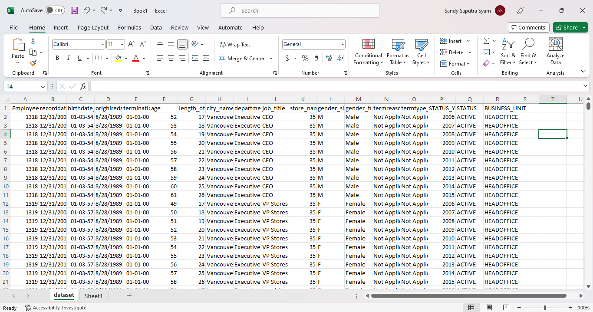

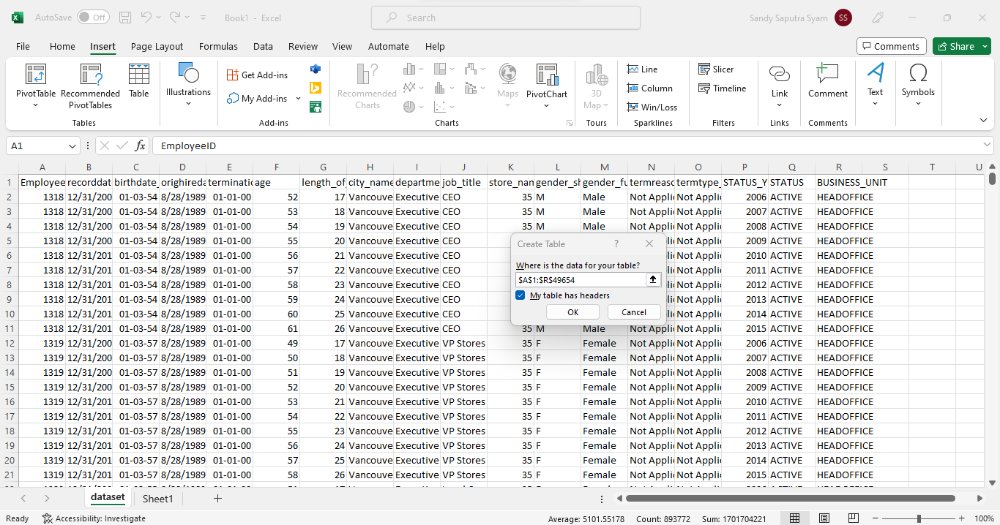

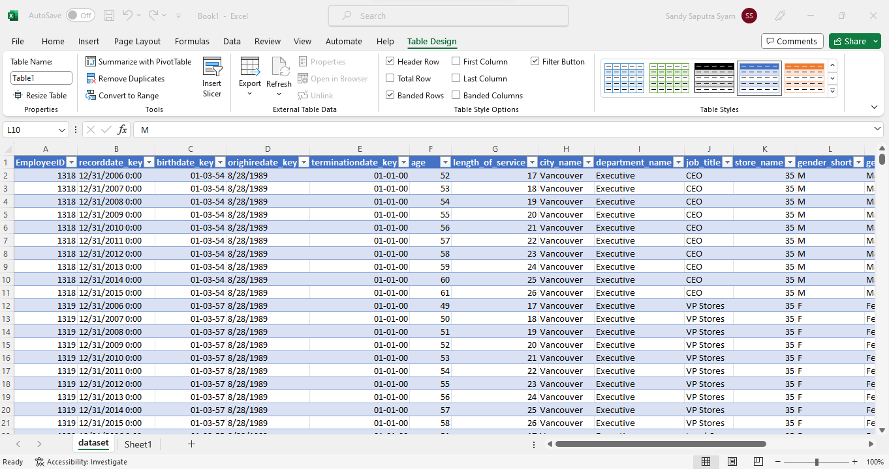

- Check column and row

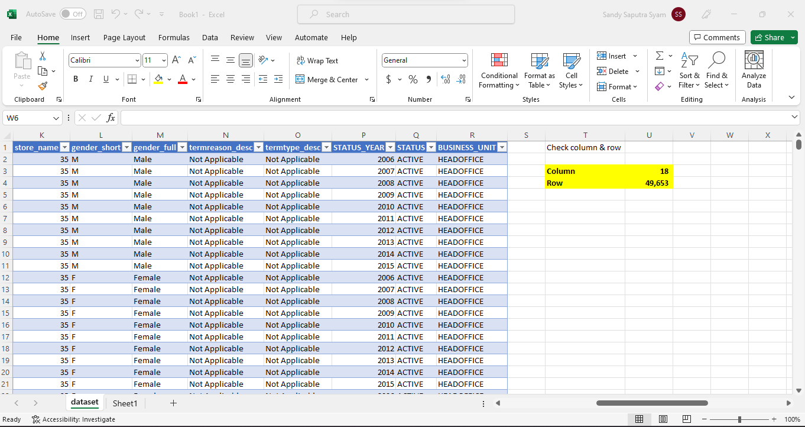

- Check duplicated

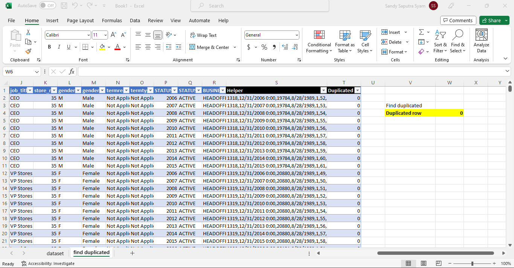

- Check Missing value

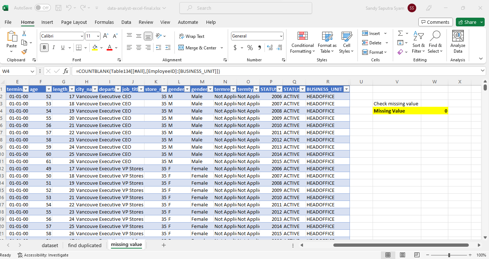

- Check dates column

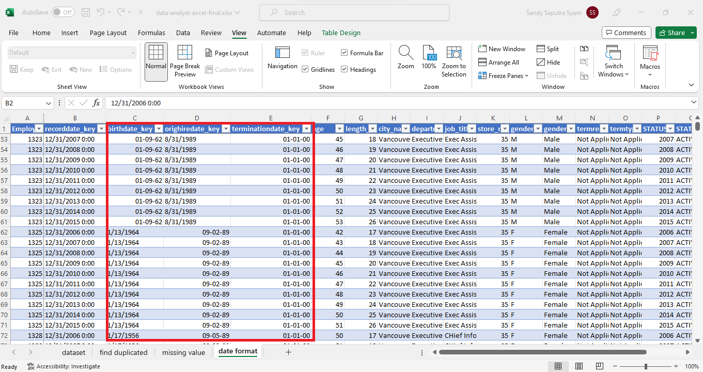

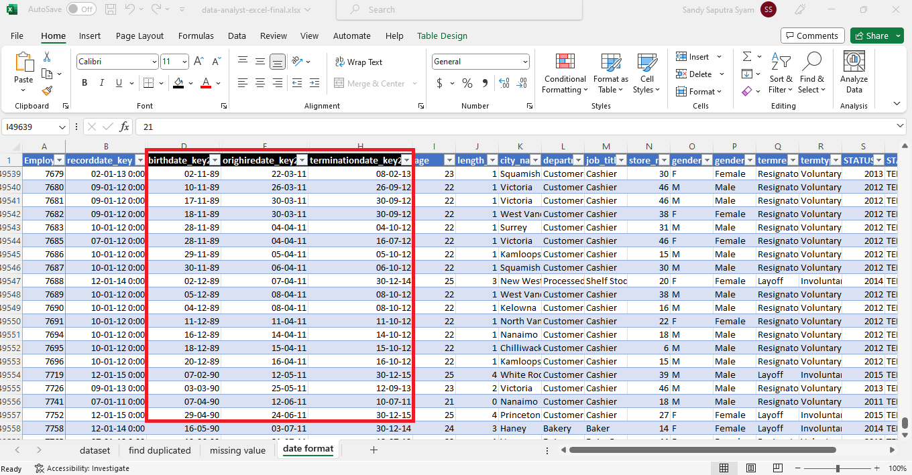

## 3. Exploratory Data Analysis

- Calculate the total number of employees with active status each year

  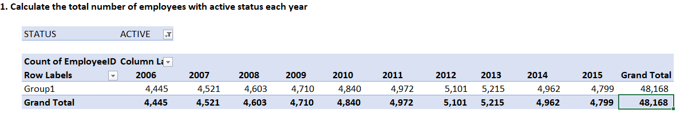

  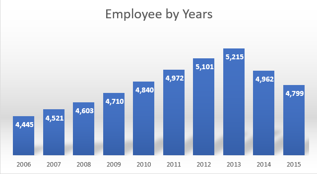

  Based on the graph of the number of employees with active status, the number of employees continued to increase from 2011 to 2013. However, there was a decrease in the number of employees in 2014 and 2015.

- Calculate the number of terminated employees each year

  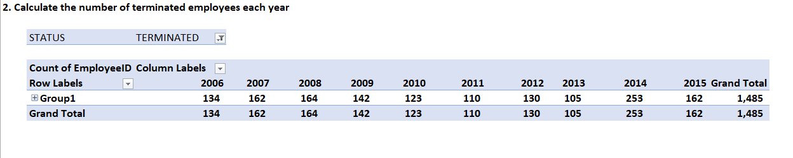

  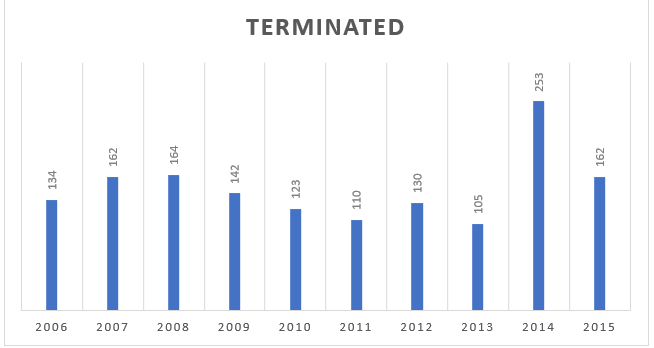

  The number of terminated employees in 2014 and 2015 was the highest compared to previous years. That is likely the cause of the decrease in the number of employees in 2014 and 2015.
  
- Ratio of termination employees each year

  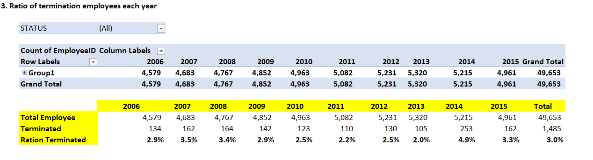

  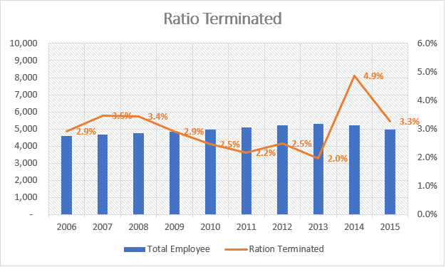
  
  If calculated based on the ratio, then 2014 is the largest ratio for terminated employees (4.9%). Meanwhile, 2013 was the year with the smallest terminated ratio at 2%. The same year, 2013, had the largest number of employees in the company.
  
- Business unit with the highest number of terminations each year

  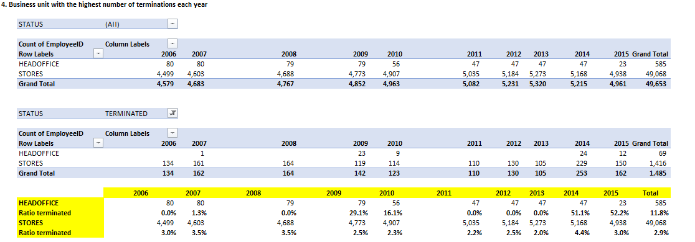

  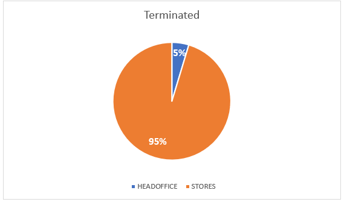

  If calculating based on the number of terminated employees, the store business unit has the most terminated employees, which is 95% of the total terminated employees. While 5% comes from the Head Office. However, if you look at the ratio of     terminated employees, it is the head office that is higher at 11.8% and the store with a ratio of 2.9%.
  
- Departments with the smallest and largest number of terminations

  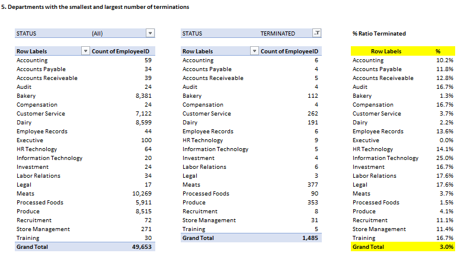

  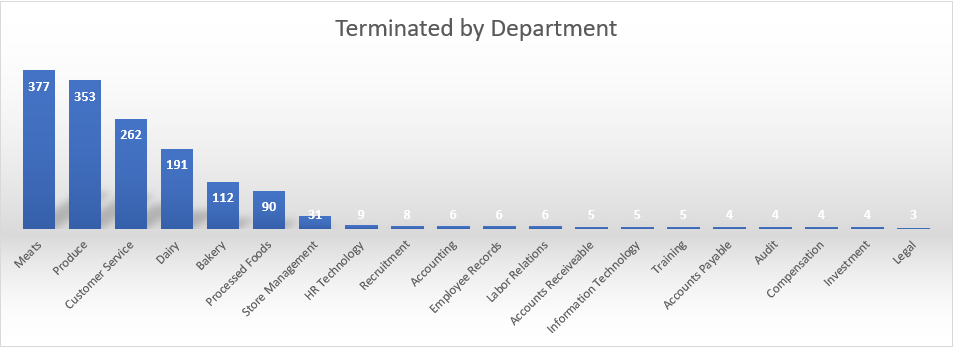

  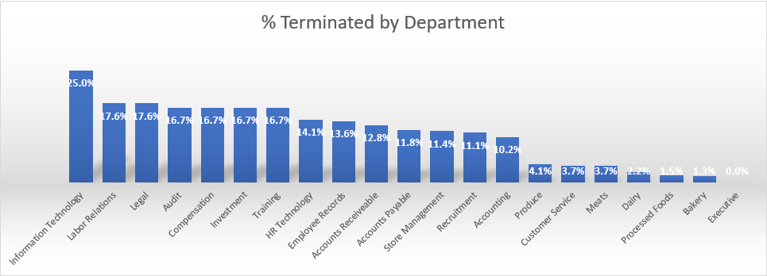

  The Meats department has the highest total terminated employees of 377 employees then the produce department of 353 and the customer service department of 262. However, these departments have a relatively small terminated ratio, namely the Meats department (3.7%), the Produce department (4.1%) and the Customer Service department (3.7%). The largest terminated ratio is found in the Information Technology department, which is 25%.
  
- Average age of employees per department

  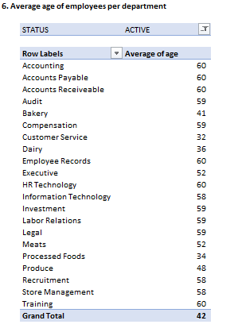

  The average age for employees with active status is 42 years old with the highest average age in the HR Technology department at 60 years old and the lowest in the Customer Service department at 32 years old.
  
- Average age of employees with termination status

  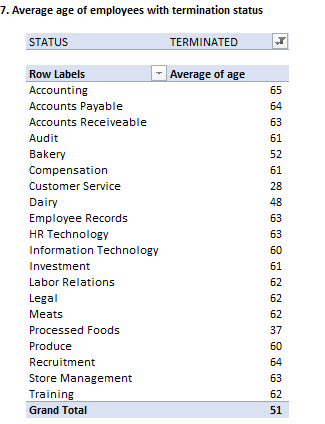

  The average age for employees with terminated status is 51 years old with the highest average age in the Accounting department at 65 years old and the lowest in the Customer Service department at 28 years old.

  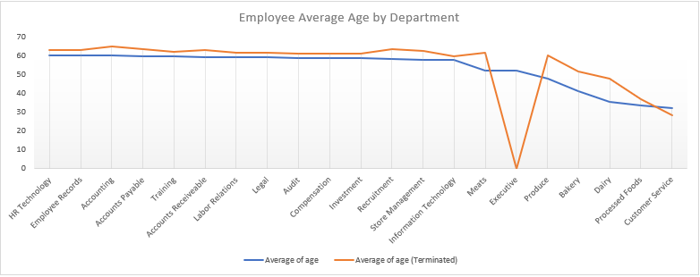

  The average age of employees with active status is lower than the average age of employees with terminated status except for Executives who have no history of termination from the beginning until 2015 and Customer Service whose average age of active employees is higher than employees with terminated status.
  
- Reasons for termination

  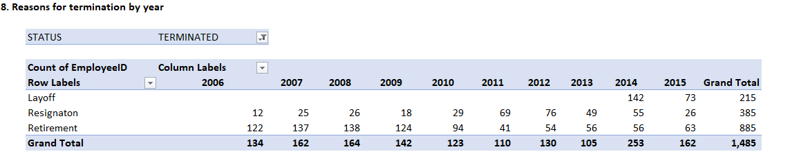

  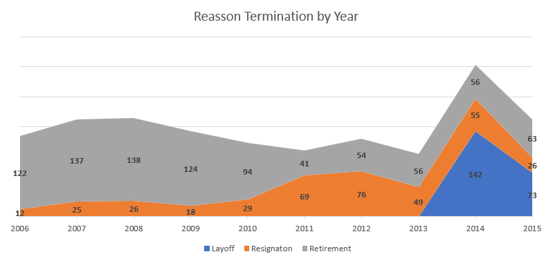

  Based on the annual trend, the drastic decline in the number of employees in 2014 and 2015 was caused by layoffs of 142 employees in 2014 and 73 employees in 2015. Layoffs only occurred in that year, throughout the history of employee data in this company.

  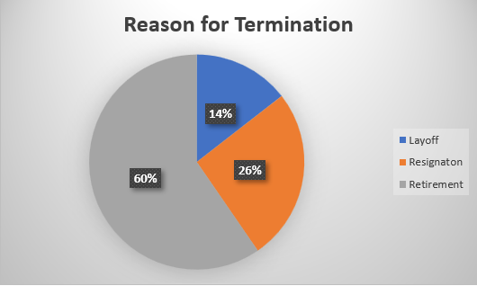

  Retirement is the largest for employees with terminated status at 60%, then Resignaton at 26% and Layoff at 14%.
  
- Average length of service of terminated employees

  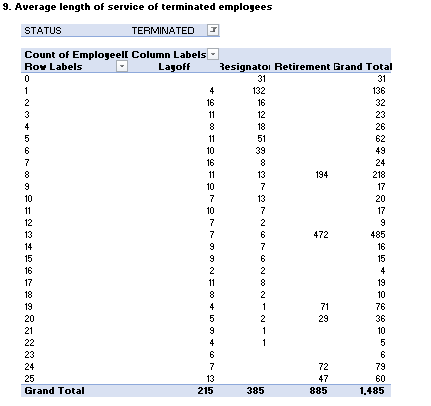

  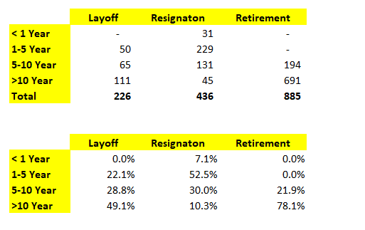

  Based on the matrix above, it is known that most employees are retired with a service period between 5-10 years (21.9%) and above 10 years (78.1%). As for the most resignaton employees with a service period of 1-5 years and the most layoff employees with a service period of> 10 years (49.1%).
  
## 4. Conclusion

Based on the analysis of employee termination data, it is known that there is a trend of employee growth from 2011 to 2013. However, in 2014 and 2015 the number of employees continued to decline. This happened because the company carried out a layoff policy in 2014 (142 employees) or around 2.9% of total employees and 2015 (73 employees) or 1.5% of total employees in that year. This layoff policy is also mostly imposed on employees with more than 10 years of service with an average age of 51 years, where in the Customer Service division the average age is 28 years and in Accounting the average age is 65 years. In addition, the number of employees who are most often terminated are employees from the Store business unit, namely in the Meats, Produce and Customer Service departments.

